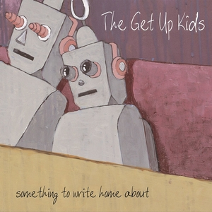

Jack’s Mannequin is a band I had not listened to before, and I’m surprised they
haven’t come across my feed. The band started as a solo project for Andrew
McMahon, and its debut album, “Everything in Transit,” takes me back to a lot of
the alternative rock albums that I loved in my high school and college days
(1995 to 2003). I still hold a special place in my heart for the music of that
era ([this is true for most of us](https://phys.org/news/2025-10-global-songs-teens.html)),
and this is an album I totally missed. It’s so whiny, and I absolutely love it.

I would describe the sound as The All-American Rejects meet The Get Up Kids:
alternative rock, but with obvious emo influences. McMahon plays piano or
keyboard on every track, but the keys often take a back seat to the guitars. The
sound reminds me of another piano pop band that doesn’t mind letting the guitar
dominate: Seth Timbs’ band, Fluid Ounces. There are great vocal harmonies
throughout the record. I’d bet LS sings those harmonies at the top of his lungs
in the car by himself, and now I will, too.

The recording and release of “Everything in Transit” was tumultuous. McMahon had
a case of laryngitis that he couldn’t shake, which tragically turned out to be
leukemia. He had already written and recorded the whole album, and the call
with the diagnosis came during a mastering session. He spent the next six months
in treatment, was back on stage that December, and went on to make a full
recovery.

:::pullquote{cite="Andrew McMahon"}
It is trying to do this thing that I think the best of pop music does… if the
lyric is really heavy, then the drums are faster… even though some of the songs
themselves were really kind of heartbroken, there was still this element of hope
in the song arrangements that meant you could dance while you felt that thing.
:::

Jack’s Mannequin pulls off the emo/alt-rock anthem as well as anyone, hitting
tropes like high rent in Los Angeles, manic pixie dream girls, and favorite
sweaters. “Holiday from Real” sets the perfect mopey tone and was a great choice
to lead off the album. “The Mixed Tape” is the album’s biggest song (“I’m
writing you a symphony of sound” is a great line), and it really lets the
frenetic piano come through in the mix.

The ballads, however, aren’t a high point for me. On “Rescued,” the writing
feels a bit hollow and overdone. I can imagine the conversation when they were
writing it: “Hey guys, it’s a ballad. What if we featured the piano in this one
instead of loud guitars?” And then, “Hey, I’ve got an idea: what if strings came
in for the second verse?” “Yeah, we’re brilliant!” (If you want to swim in
piano-infused emotional ballads, check out “Boxing” or “Evaporated” from Ben
Folds Five instead.)

By the way, that girl McMahon was so whiny about throughout the album? They are
still married and have a daughter, Cecilia.

A few tracks that I found notable:

- **“Holiday from Real”:** The lead track and one of the singles. A great anthem
  to kick off the album.
- **“Into the Airwaves”:** “From an empty room on the first floor / As the cars
  pass by the liquor store / I deconstruct my thoughts at this piano.” Singing
  about writing the song that you’re singing: it doesn’t get much more emo than
  this.
- **“MFEO”:** I’m a sucker for a multi-part song. The layering of sounds in the
  intro to Part 1 screams the Beach Boys’ “Pet Sounds,” actively channeling
  Brian Wilson on “God Only Knows.”

:::notes
One interesting production concept to listen for is how much they clearly loved
the sound of piano reverberation. At the end of tracks, you can often hear that
piano decay ringing out, even if you couldn’t hear a piano anywhere in the main
mix of the song.

If you want to get to know your favorite artists better, I highly recommend
“What’s in My Bag?” from Amoeba Music. Musicians browse Amoeba’s huge collection
and talk about what’s “in their bag.” Check out
[Andrew McMahon’s selections](https://www.youtube.com/watch?v=aTkt5UfNiZM). It’s no surprise that Counting Crows’
“August and Everything After” made his list; he shares the “mopey LA music” gene
with Adam Duritz.

For even more background, you can also check out this
[complete history of “Everything in Transit”](https://www.youtube.com/watch?v=fDuu172htxM&t=272s) on YouTube.
:::

If you love this album, I also recommend: The Get Up Kids’ landmark album,
[“Something to Write Home About”](https://music.youtube.com/playlist?list=OLAK5uy_kiyoQsypOvovbEkLhNeNCPT99k176IlrA).
Odds are you already love The Get Up Kids. If not, now you have homework.

