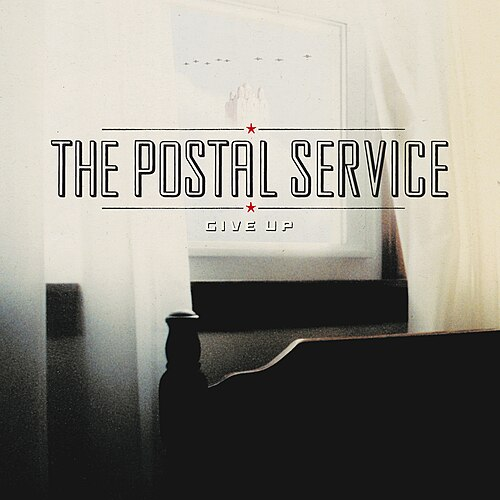

I love a distorted guitar. There’s raw power and emotion in that sound. But it’s
usually reserved for certain styles of music. Kelela is an artist that has taken
a deep dive into finding the intersection of musical styles without regard for
what is typically expected. I’ve been listening to her third studio album,
“new avatar”, and it’s really scratched an itch for me.

Kelela is an Ethiopian-American artist and self-proclaimed “DC girl.” She
released her first project at the age of 30 and identifies as a “late
bloomer.” The influence of jazz, metal, and “guitar” music is pervasive on
“new avatar.”

I’ll be honest: Kelela’s “new avatar” is not an album that would have popped up
on my playlist organically (thanks, BG). I knew nothing about Kelela before she
was recommended to me. Described as “R&B run through distorted guitar,” the
record combines R&B, indie rock, grunge, and complex arrangements into something
that feels like it was written just for me.

:::pullquote{cite="Kelela, on “crystalize,” to Zane Lowe"}
What if Whitney Houston sang over a Cocteau Twins piece and Phil Collins
produced it?
:::

In a recent interview with Zane Lowe, Kelela opened up about her creative
background and showed that she knows exactly what she’s doing. She’s creating an
intersection of styles that seem completely divergent at a glance but are a
perfect match for those of us who love to “nerd out on music.”

Some standout quotes from her chat with Lowe that perfectly capture the vibe of
this album:

- **On her song-writing goals:** She mentioned “looking for the palace between
  Beyoncé and Björk.”
- **On her growth as an artist:** Noting that some of her favorite bands had
  40–50 people in the room for a show, she aims to capture those “avant-garde
  sounds and intersections.”
- **On the song “crystalize”:** “What if Whitney Houston sang over a Cocteau
  Twins piece and Phil Collins produced it?”
- **On authenticity:** “I’m not trying to sell you nothing that I’m not buying.”

A few tracks that I found notable:

- **“idea 1”:** A beautiful blend of delicate arpeggios clashing with that
  signature distorted guitar.
- **“linknb”:** A highlight for me. With its floating lyrics gliding over
  electronic drums and an arpeggiated synth, it sounds like a track straight off
  a Radiohead album.
- **“the bridge”:** A collaboration featuring PinkPantheress, 80s vibe showcasing a synth pad and driving electronic drums.

:::notes
If you want an introduction to Kelela before diving into the heavy production of
“new avatar”, start with her
[NPR Tiny Desk Concert](https://www.youtube.com/watch?v=3prk1I5ged0). I love
Tiny Desk: it’s an opportunity for artists to share their music in an intimate
atmosphere. For this set, Kelela swapped out some of the rhythm from her studio
recordings for piano and harp. Conceptually, this reminds me of Daft Punk’s
“Random Access Memories”
[“drumless” release](https://www.youtube.com/playlist?list=PLSbDLF8wQ3oJuil0otPvI3dUwRtQYkYYw).
With the drum track stripped out, the music really gets a chance to breathe,
allowing you to hyper-focus on the vocals and complex harmonic decisions.
:::

I think “new avatar” might be peak Kelela for me, but it has definitely made me
game to check out her earlier work.

If you love this album, I also recommend: The Postal Service’s masterpiece,
[“Give Up”](https://music.youtube.com/playlist?list=OLAK5uy_lBqmhyIzBFgDas7CrjU3eq7VnTjwZH4Mg). That album’s combination of indie rock and electronica scratches the
exact same itch for me that “new avatar” does, beautiful,
introspective vocals over deep, rhythmic arrangements.

